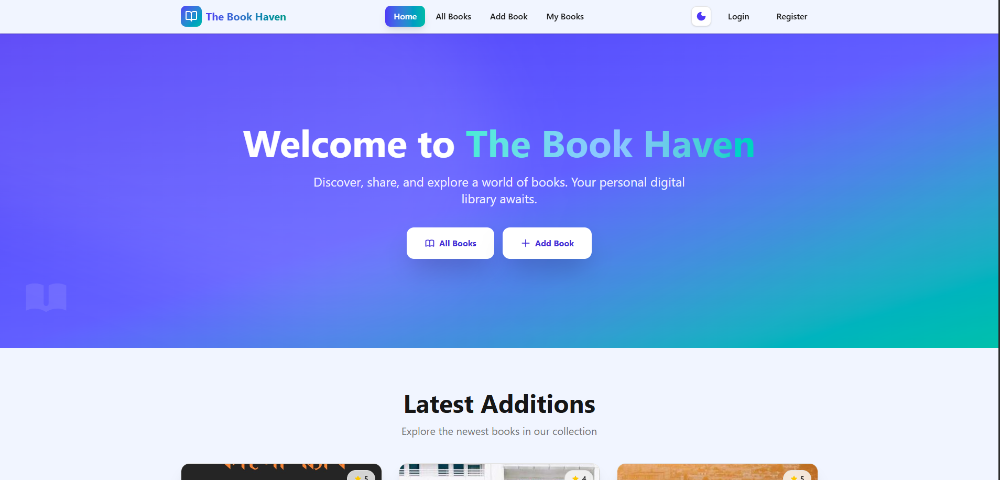
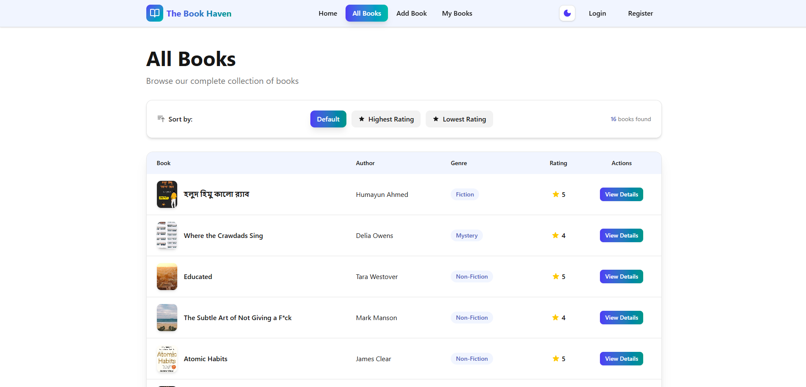
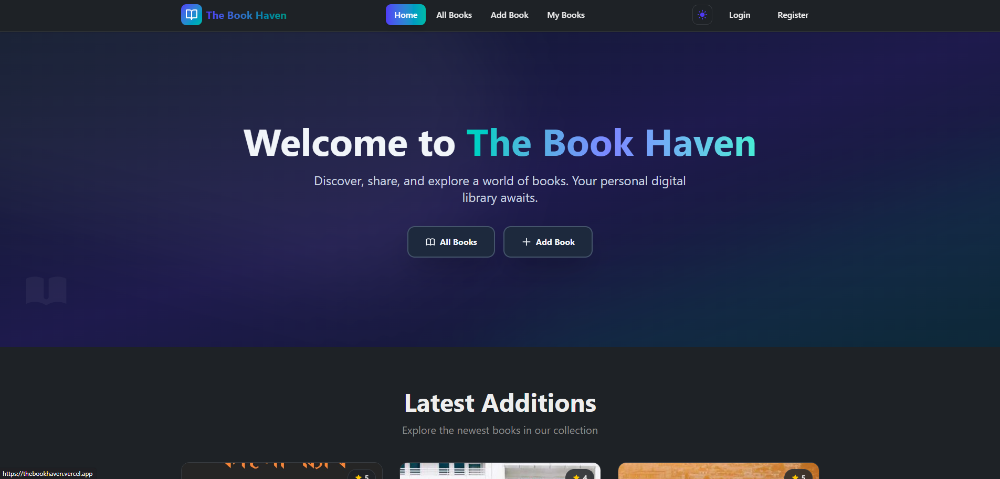
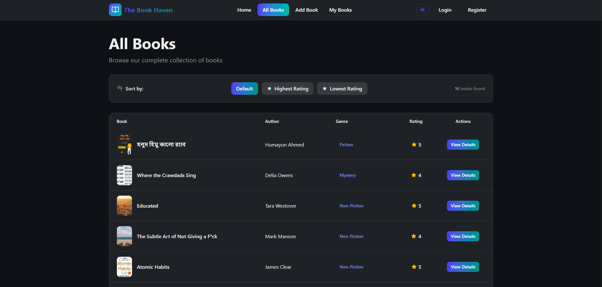

# 📚 The Book Haven

A full-stack digital library application where book lovers can discover, share, and manage their favorite books. Built with modern web technologies, this platform offers a seamless experience for exploring literary collections and engaging with a community of readers.

<div align="center">
  <table>
    <tr>
      <td width="50%">
        
      </td>
      <td width="50%">
        
      </td>
    </tr>
    <tr>
      <td width="50%">
        
      </td>
      <td width="50%">
        
      </td>
    </tr>
  </table>
</div>

## 📋 Overview

The Book Haven is a comprehensive book management platform that combines the functionality of a digital library with social features. Users can build their personal book collections, discover new titles, rate and review books, and engage in discussions with fellow book enthusiasts. The application features a modern, responsive design with dark/light theme support and smooth animations for an enhanced user experience.

## ✨ Features

- 🔐 **Secure Authentication System** - Complete user authentication with Firebase supporting email/password login and Google OAuth integration. Password validation ensures strong security with uppercase, lowercase, and minimum length requirements.

- 📚 **Comprehensive Book Management** - Full CRUD functionality allowing users to add new books with cover images, update their existing entries, delete books they've added, and view detailed information about any book in the collection with a beautifully designed interface.

- 🌓 **Dark/Light Theme Toggle** - Seamless theme switching with persistent storage, allowing users to choose their preferred viewing mode. The elegant transition affects the entire application, providing optimal readability in any lighting condition.

- 💬 **Interactive Comments & Reviews** - Interactive commenting system on book detail pages where authenticated users can share their thoughts, see comments from other readers with timestamps, and engage in meaningful discussions about their favorite books.

- ⭐ **Advanced Filtering & Sorting** - Smart book discovery with multiple sorting options including highest rated, lowest rated, and newest additions. The intuitive filtering system helps users find exactly what they're looking for in the collection.

- 🎨 **Modern UI/UX** - Built with Shadcn UI components and Tailwind CSS for a clean, professional interface. Includes smooth animations powered by Framer Motion and responsive design that works seamlessly across all devices.

- 🔒 **Protected Routes** - Secure page access with authentication middleware ensuring only authorized users can access certain features like adding books or viewing detailed information.

## 🚀 Technologies Used

### Frontend

- **React 19.1** - Modern UI library with hooks and context API
- **React Router 7.9** - Client-side routing with protected routes
- **Tailwind CSS 4.1** - Utility-first CSS framework
- **Framer Motion 12** - Smooth animations and transitions
- **Shadcn UI** - Beautifully designed component library
- **Radix UI** - Unstyled, accessible component primitives
- **Lucide React** - Beautiful & consistent icon set
- **Axios 1.13** - Promise-based HTTP client
- **Firebase 12.5** - Authentication service
- **date-fns 4.1** - Modern JavaScript date utility library

### UI Components & Utilities

- **React Hot Toast** - Beautiful toast notifications
- **SweetAlert2** - Elegant popup boxes
- **Sonner** - Toast notifications with rich features
- **React Tooltip** - Accessible tooltip component
- **Yup** - Schema validation for forms
- **clsx & tailwind-merge** - Utility for constructing className strings

### Development Tools

- **Vite 7.1** - Next generation frontend tooling
- **ESLint 9** - Pluggable JavaScript linter
- **@vitejs/plugin-react** - Official Vite plugin for React

### Backend

- **Node.js & Express** - Server-side runtime and framework
- **MongoDB Atlas** - Cloud database service
- **Firebase Admin SDK** - Server-side authentication

## 📦 Dependencies

### Production Dependencies

```json
{
  "@radix-ui/react-checkbox": "^1.3.3",
  "@radix-ui/react-label": "^2.1.8",
  "@radix-ui/react-select": "^2.2.6",
  "@radix-ui/react-separator": "^1.1.8",
  "@radix-ui/react-slot": "^1.2.4",
  "@tailwindcss/vite": "^4.1.16",
  "@vercel/analytics": "^1.5.0",
  "axios": "^1.13.2",
  "class-variance-authority": "^0.7.1",
  "clsx": "^2.1.1",
  "date-fns": "^4.1.0",
  "firebase": "^12.5.0",
  "framer-motion": "^12.23.24",
  "lucide-react": "^0.552.0",
  "next-themes": "^0.4.6",
  "react": "^19.1.1",
  "react-dom": "^19.1.1",
  "react-hot-toast": "^2.6.0",
  "react-router": "^7.9.5",
  "react-tooltip": "^5.30.0",
  "sonner": "^2.0.7",
  "styled-components": "^6.1.19",
  "sweetalert2": "^11.26.3",
  "tailwind-merge": "^3.3.1",
  "tailwindcss": "^4.1.16",
  "yup": "^1.7.1"
}
```

### Development Dependencies

```json
{
  "@eslint/js": "^9.36.0",
  "@types/react": "^19.1.16",
  "@types/react-dom": "^19.1.9",
  "@vitejs/plugin-react": "^5.0.4",
  "eslint": "^9.36.0",
  "eslint-plugin-react-hooks": "^5.2.0",
  "eslint-plugin-react-refresh": "^0.4.22",
  "globals": "^16.4.0",
  "tw-animate-css": "^1.4.0",
  "vite": "^7.1.7"
}
```

## 🛠️ Local Setup

Follow these steps to run the project on your local machine:

### Prerequisites

- Node.js (v18 or higher)
- npm or yarn package manager
- Firebase project with Authentication enabled
- MongoDB Atlas account (for backend)

### Installation

1. **Clone the repository**

```bash
git clone https://github.com/AffanHossainRakib/The-Book-Haven.git
cd The-Book-Haven
```

2. **Install dependencies**

```bash
npm install
```

3. **Set up environment variables**

Create a `.env.local` file in the root directory:

```env
VITE_FIREBASE_API_KEY=your_firebase_api_key
VITE_FIREBASE_AUTH_DOMAIN=your_firebase_auth_domain
VITE_FIREBASE_PROJECT_ID=your_firebase_project_id
VITE_FIREBASE_STORAGE_BUCKET=your_firebase_storage_bucket
VITE_FIREBASE_MESSAGING_SENDER_ID=your_firebase_messaging_sender_id
VITE_FIREBASE_APP_ID=your_firebase_app_id
VITE_API_URL=your_backend_api_url
```

4. **Start the development server**

```bash
npm run dev
```

5. **Open your browser**

Navigate to `http://localhost:5173` (or the port shown in your terminal)

### Available Scripts

- `npm run dev` - Start development server with Vite
- `npm run build` - Build for production
- `npm run preview` - Preview production build locally
- `npm run lint` - Run ESLint to check code quality

## 📂 Project Structure

```
PH-Assignment10-client/
├── public/                          # Static assets
│   ├── screenshot-1.png            # Light mode screenshot
│   ├── screenshot-2.png            # Light mode screenshot
│   ├── dark-screenshot-1.png       # Dark mode screenshot
│   ├── dark-screenshot-2.png       # Dark mode screenshot
│   └── favicon.png                 # Favicon
├── src/
│   ├── components/                 # Reusable UI components
│   │   ├── Footer/                # Footer component
│   │   │   └── Footer.jsx
│   │   ├── Header/                # Navigation component
│   │   │   └── Navbar.jsx
│   │   ├── Home/                  # Home page sections
│   │   │   ├── AboutSection.jsx
│   │   │   ├── GenresSection.jsx
│   │   │   └── HeroBanner.jsx
│   │   ├── Loader/                # Loading spinner
│   │   │   ├── Loader.css
│   │   │   └── Loader.jsx
│   │   ├── Shared/                # Shared components
│   │   │   ├── BookCard.jsx
│   │   │   └── BookDetails.jsx
│   │   └── ui/                    # Shadcn UI components
│   │       ├── badge.jsx
│   │       ├── button.jsx
│   │       ├── card.jsx
│   │       ├── field.jsx
│   │       ├── input.jsx
│   │       ├── label.jsx
│   │       ├── separator.jsx
│   │       ├── sonner.jsx
│   │       └── spinner.jsx
│   ├── Contexts/                   # React Context providers
│   │   ├── AuthContext.jsx        # Authentication context
│   │   ├── AuthProvider.jsx       # Auth provider wrapper
│   │   └── ThemeContext.jsx       # Theme management
│   ├── Firebase/                   # Firebase configuration
│   │   └── firebase.init.js
│   ├── hooks/                      # Custom React hooks
│   │   ├── useAuth.js             # Authentication hook
│   │   ├── useAxios.js            # Axios instance hook
│   │   ├── useAxiosSecure.jsx     # Secure axios hook
│   │   └── useTheme.js            # Theme management hook
│   ├── Layouts/                    # Layout components
│   │   ├── AuthLayout.jsx         # Auth pages layout
│   │   └── MainLayout.jsx         # Main app layout
│   ├── pages/                      # Page components
│   │   ├── AddBook/               # Add new book page
│   │   │   └── AddBook.jsx
│   │   ├── AllBooks/              # All books listing
│   │   │   ├── AllBooks.jsx
│   │   │   └── BookTable.jsx
│   │   ├── Auth/                  # Authentication pages
│   │   │   ├── Login/
│   │   │   │   ├── Login.jsx
│   │   │   │   └── login-form.jsx
│   │   │   ├── Signup/
│   │   │   │   ├── Signup.jsx
│   │   │   │   └── signup-form.jsx
│   │   │   └── ForgotPassword/
│   │   │       └── ForgotPassword.jsx
│   │   ├── Home/                  # Landing page
│   │   │   └── Home.jsx
│   │   ├── MyBooks/               # User's books page
│   │   │   ├── MyBooks.jsx
│   │   │   └── UpdateBook.jsx
│   │   └── NotFound/              # 404 page
│   │       └── NotFound.jsx
│   ├── Routes/                     # Routing configuration
│   │   ├── PrivateRoute.jsx       # Protected route wrapper
│   │   └── Routes.jsx             # Route definitions
│   ├── constants/                  # App constants
│   │   └── theme.js
│   ├── lib/                        # Utility functions
│   │   └── utils.js
│   ├── main.jsx                    # Application entry point
│   └── index.css                   # Global styles
├── components.json                 # Shadcn UI config
├── eslint.config.js               # ESLint configuration
├── index.html                      # HTML entry point
├── jsconfig.json                   # JavaScript config
├── package.json                    # Dependencies and scripts
├── vercel.json                     # Vercel deployment config
└── vite.config.js                 # Vite configuration
```

## 🔗 API Endpoints

### Books

- `GET /latest-books` - Get latest 6 books (Public)
- `GET /all-books?sort=rating_desc|rating_asc` - Get all books with sorting (Protected)
- `GET /book/:id` - Get single book details (Protected)
- `GET /my-books?email=user@email.com` - Get user's books (Protected)
- `POST /books` - Add new book (Protected)
- `PUT /book/:id` - Update book (Protected)
- `DELETE /book/:id` - Delete book (Protected)

### Comments

- `GET /book/:id/comments` - Get all comments for a book (Protected)
- `POST /book/:id/comments` - Add comment to a book (Protected)

## 🎯 Key Functionalities

### Authentication Flow

- User registration with email and password
- Google OAuth integration for social login
- Password strength validation (uppercase, lowercase, 6+ characters)
- Protected routes with automatic redirection
- Persistent authentication state
- Secure logout with confirmation

### Book Management

- Add books with title, author, genre, rating (1-5), summary, and cover image URL
- Real-time image preview before submission
- Update existing books with pre-filled form data
- Delete books with confirmation dialog
- Ownership verification ensures users can only modify their own books
- Comprehensive validation for all input fields

### User Experience

- Smooth page transitions with Framer Motion
- Skeleton loading states for better perceived performance
- Toast notifications for all user actions
- Responsive design optimized for mobile, tablet, and desktop
- Dark/light theme with system preference detection
- Custom 404 page with navigation options

### Comments & Engagement

- Add comments to any book detail page
- View all comments with user information and timestamps
- Character limit validation (1-1000 characters)
- Formatted timestamps using date-fns
- Empty state handling with helpful messages

## 🔒 Security Features

- Firebase Authentication for secure user management
- JWT token-based API authentication
- Protected routes with authentication middleware
- Ownership validation for update/delete operations
- Input sanitization and validation on client and server
- Secure password requirements enforcement
- CORS configuration for API security

## 🌐 Live Demo

Visit the live application: **[The Book Haven](https://thebookhaven.vercel.app/)**

## 🌍 Browser Support

- Chrome (latest)
- Firefox (latest)
- Safari (latest)
- Edge (latest)
- Opera (latest)

## 🤝 Contributing

This is an academic project, but feedback and suggestions are always welcome!

1. Fork the repository
2. Create a feature branch (`git checkout -b feature/amazing-feature`)
3. Commit your changes (`git commit -m 'Add some amazing feature'`)
4. Push to the branch (`git push origin feature/amazing-feature`)
5. Open a Pull Request

## 📝 License

This project is created for educational purposes as part of Programming Hero's Web Development course.

## 👨‍💻 Author

**Md. Affan Hossain Rakib**

- Portfolio: [itsaffan.vercel.app](https://itsaffan.vercel.app)
- GitHub: [@AffanHossainRakib](https://github.com/AffanHossainRakib)

## 🙏 Acknowledgments

- Programming Hero for the comprehensive web development curriculum
- Firebase for robust authentication services
- MongoDB Atlas for reliable cloud database hosting
- Vercel for seamless deployment platform
- Shadcn UI for beautiful component library
- The React and Node.js communities for excellent documentation and support

## 📧 Contact

For any queries, feedback, or collaboration opportunities, feel free to reach out through the project repository or visit my portfolio.

---

**Made with ❤️ by [Md. Affan Hossain Rakib](https://itsaffan.vercel.app)**
